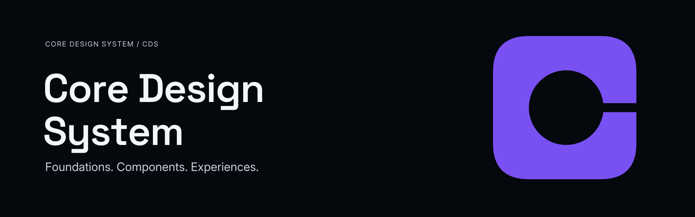

<p align="center">
  
</p>

<h1 align="center">Core Design System (CDS)</h1>

<p align="center">
  <a href="docs/governance/NDF_SKILLS_PROVENANCE.md"></a>
  <a href="docs/decisions/ADR-0001-MACHINE_READABLE_TOKEN_SOURCE_FORMAT.md"></a>
  <a href="docs/governance/GOVERNANCE_OPERATING_MODEL.md"></a>
  <a href="docs/governance/LICENSING_AND_PUBLICATION_DECISION_MODEL.md"></a>
</p>

<p align="center"><strong>Foundations · Components · Experiences</strong></p>
<p align="center">Semantic-first · Accessibility as policy · Evidence-bound · Human-controlled</p>

**DE:** Das Core Design System (CDS) ist ein gesteuertes Design System, mit dem digitale
Produkte über verschiedene Consumer und Kanäle hinweg konsistent, barrierearm und
nachweisbasiert gestaltet werden. Es trennt bewusst Foundations, Tokens, Komponenten,
Patterns, Experiences, Kanal- und Produktanpassung sowie Evidenz und Reifegrad — und
bildet dafür eine versionierte, normative Single Source of Truth.

**EN:** The Core Design System (CDS) is a governed design system for building
consistent, accessible and evidence-backed digital products across different consumers
and channels. It deliberately separates foundations, tokens, components, patterns,
experiences, channel and product adaptation, and evidence and maturity — held in one
versioned, normative Single Source of Truth.

> [!NOTE]
> **DE:** CDS befindet sich in aktiver, strukturierter Entwicklung. Es gibt kein Release,
> kein `Stable`-Artefakt, keine visuellen Werte und keine gültige Konformitätsaussage —
> siehe [Aktueller Entwicklungsstand](#current-development-status--aktueller-entwicklungsstand).
>
> **EN:** CDS is under active, structured development. There is no release, no `Stable`
> artifact, no visual value and no valid conformance claim — see
> [Current Development Status](#current-development-status--aktueller-entwicklungsstand).

## Contents / Inhalt

- **Start:** [What is CDS?](#what-is-cds--was-ist-cds) · [Quick Start](#quick-start--schnellstart) · [Why CDS?](#why-cds--warum-cds)
- **Design System:** [Design-System Model](#design-system-model--design-system-modell) · [Foundations & Tokens](#foundations--tokens) · [Components & Patterns](#components--patterns--komponenten--patterns) · [Accessibility](#accessibility--barrierefreiheit) · [Evidence & Maturity](#evidence--maturity--evidenz--reifegrad)
- **Integration:** [Consumer Model](#consumer-model--consumer-modell) · [NDF & CDS](#ndf--cds)
- **Development / Entwicklung:** [Governance & Authority](#governance--authority--governance--autorität) · [Current Development Status](#current-development-status--aktueller-entwicklungsstand) · [Work Packages](#work-packages)
- **Reference / Referenz:** [Documentation Map](#documentation-map--dokumentationsübersicht) · [Repository Structure](#repository-structure--repository-struktur) · [Language](#language--sprache) · [Project Status](#project-status--projektstatus)

## What is CDS? / Was ist CDS?

**DE:** CDS ist die zentrale Design-, Marken-, UX-, UI-, Token-, Komponenten-, Dokument-
und Multi-Channel-Grundlage des Core-Ökosystems. Es legt fest, wie Core-Produkte
aussehen, sich verhalten, kommunizieren und über Kanäle hinweg barrierearm bleiben —
als normative, versionierte und offline nutzbare Quelle statt als verstreute
Produktkonventionen. CDS ist **kein** reines Logo- oder Branding-Kit, **keine** isolierte
UI-Komponentenbibliothek und **kein** Designprojekt nur für ein einzelnes Produkt.

**EN:** CDS is the central design, brand, UX, UI, token, component, document and
multi-channel foundation of the Core ecosystem. It defines how Core products look,
behave, communicate and remain accessible across channels — as a normative, versioned
source usable offline rather than scattered product conventions. CDS is **not** a
logo-only or branding kit, **not** an isolated UI component library, and **not** a
design project scoped to a single product.

| Available today / Heute verfügbar | Not yet / Noch nicht |
| --- | --- |
| Governance, scope, architecture and accessibility policy as normative documents | Visual values — colour, type, spacing, radius, elevation, motion: **0** |
| A decided machine-readable token format: DTCG 2025.10-based CDS profile in strict JSON | Visual Source Sets: **0** |
| Five CDS-owned JSON Schema 2020-12 contracts and an offline validator | Components or patterns specified: **0** |
| The Visual Foundation architecture and the reference/semantic token-layer contracts — structure only | `Stable` artifacts: **0** |
| The **Semantic Status Foundation** — the one `Candidate` artifact family (non-visual) | Release, tag, licence, public availability |

Consumers: CoreOps is the first reference consumer; further Core products are
anticipated — see [Consumer Model](#consumer-model--consumer-modell).

## Quick Start / Schnellstart

**DE:** CDS hat kein Installationskommando und kein Paket — der Einstieg führt über
Dokumente. Neu hier? Mit Pfad **A** beginnen.

**EN:** CDS has no install command and no package — you start from its documents. New
here? Begin with path **A**.

| Path / Pfad | Goal / Ziel | Start here / Einstieg | Next / Danach |
| --- | --- | --- | --- |
| **A** | Understand CDS / CDS verstehen | [Concept and Scope](docs/governance/CONCEPT_AND_SCOPE.md) | [Project Charter](docs/governance/PROJECT_CHARTER.md) · [Scope Boundary Matrix](docs/governance/SCOPE_BOUNDARY_MATRIX.md) |
| **B** | Understand the architecture / Architektur verstehen | [Design System Architecture](docs/architecture/DESIGN_SYSTEM_ARCHITECTURE.md) | [Source of Truth and Authority Model](docs/architecture/SOURCE_OF_TRUTH_AND_AUTHORITY_MODEL.md) · [Token and Theme Architecture](docs/architecture/TOKEN_AND_THEME_ARCHITECTURE.md) |
| **C** | Explore foundations / Foundations erkunden | [Visual Foundation Architecture](docs/architecture/VISUAL_FOUNDATION_ARCHITECTURE.md) | [Semantic Status Foundation Contract](docs/foundations/SEMANTIC_STATUS_FOUNDATION_CONTRACT.md) · [Visual Semantic Token Foundation](docs/architecture/VISUAL_SEMANTIC_TOKEN_FOUNDATION.md) |
| **D** | Work with tokens and validation / Mit Tokens und Validierung arbeiten | [Machine-Readable Source Model](docs/architecture/MACHINE_READABLE_SOURCE_MODEL.md) | [CDS Token Format Profile](docs/architecture/CDS_TOKEN_FORMAT_PROFILE.md) · [Offline Token Validator Usage](docs/operations/OFFLINE_TOKEN_VALIDATOR_USAGE.md) |
| **E** | Understand consumers / Consumer verstehen | [Consumer and Stakeholder Model](docs/governance/CONSUMER_AND_STAKEHOLDER_MODEL.md) | [Consumer Requirements Model](docs/governance/CONSUMER_REQUIREMENTS_MODEL.md) · [CoreOps Pilot Contract](docs/governance/COREOPS_PILOT_CONTRACT.md) |
| **F** | Understand governance / Governance verstehen | [Governance Operating Model](docs/governance/GOVERNANCE_OPERATING_MODEL.md) | [Project Profile](project-system/PROJECT_PROFILE.md) · [Foundation Operating Playbook](docs/operations/FOUNDATION_OPERATING_PLAYBOOK.md) |
| **G** | Follow development / Entwicklung verfolgen | [Work Packages](project-system/WORK_PACKAGES.md) | [Post-Candidate Development Roadmap](docs/roadmap/POST_CANDIDATE_DEVELOPMENT_ROADMAP.md) · [Decision Index](docs/decisions/DECISION_INDEX.md) · [CHANGELOG](CHANGELOG.md) |

The offline validator runs locally on Python 3.11+ with the exactly pinned stack in
[requirements-validator.lock](requirements-validator.lock), installed into a virtual
environment outside the repository — see
[Validator Usage](docs/operations/OFFLINE_TOKEN_VALIDATOR_USAGE.md):

```bash
python -m tools.cds_validator validate-file <document> --report <out.json>
```

## Why CDS? / Warum CDS?

**DE:** Ohne gemeinsame Grundlage entscheidet jedes Produkt dieselben Designfragen neu —
mit anderen Antworten und ohne gemeinsame Begründung. Designabsicht lebt in Tools,
Screenshots und Erinnerung statt in einer prüfbaren Quelle; Produkte driften
auseinander; Barrierefreiheit wird spät und uneinheitlich behandelt; Design, Code und
Dokumentation beschreiben verschiedene Wirklichkeiten. CDS löst das strukturell statt
pro Produkt.

**EN:** Without a shared foundation, every product re-decides the same design questions —
with different answers and no shared rationale. Design intent lives in tools,
screenshots and memory instead of a reviewable source; products drift apart;
accessibility is handled late and inconsistently; design, code and documentation
describe different realities. CDS solves this structurally rather than per product.

| Principle | DE | EN |
| --- | --- | --- |
| **Semantics first** | Bedeutung kommt vor Wert: Rollen und Status werden definiert, bevor ein visueller Wert sie trägt. | Meaning precedes value: roles and status are defined before any visual value carries them. |
| **One authoritative source** | Nur normative Quellen binden; generierte Artefakte, Tool-Zustände und Beispiele nie. Konflikte schlagen fail-closed fehl. | Only normative sources bind; generated artifacts, tool state and examples never do. Conflicts fail closed. |
| **Accessibility as policy** | WCAG 2.2 AA ist das Ziel — mit Evidenzstufen statt Behauptungen. | WCAG 2.2 AA is the target — with evidence levels instead of assertions. |
| **Evidence-bound maturity** | Reifegrad wird an Revisionen und zugelassene Evidenz gebunden, nie vererbt. | Maturity is bound to revisions and admitted evidence, never inherited. |
| **Multi-consumer by design** | CoreOps ist Referenz-Consumer, aber nicht das einzige Designziel. | CoreOps is a reference consumer, not the sole design target. |
| **Offline and self-hosted** | Quellen, Schemas und Validator funktionieren ohne Netzwerk. | Sources, schemas and validator work without a network. |

Details: [Concept and Scope](docs/governance/CONCEPT_AND_SCOPE.md) ·
[Design System Benchmark](docs/research/DESIGN_SYSTEM_BENCHMARK.md) (research — not normative) ·
[CDS Differentiation Hypotheses](docs/research/CDS_DIFFERENTIATION_HYPOTHESES.md) (hypotheses — not claims)

## Design-System Model / Design-System-Modell

**DE:** Die logische Architektur (DEC-S-021) ordnet CDS in acht Schichten. Eine Schicht
darf nur von den darüberliegenden abhängen — nie umgekehrt. Das Modell ist logisch und
bildet weder Verzeichnisse noch Pakete oder Tools ab.

**EN:** The logical architecture (DEC-S-021) arranges CDS in eight layers. A layer may
depend only on the layers above it — never the reverse. The model is logical and maps to
no directory, package or tool.

```text
1  Strategy & Governance       mission, scope, decisions, maturity, change control
2  Brand & Identity            masterbrand, product identity, verbal identity, brand assets
3  Foundations & Tokens        colour, type, space, layout, shape, surface, icons, themes, status
4  Components                  contract-bearing components: anatomy, states, accessibility
5  Patterns & Experiences      task flows, navigation, feedback, safe actions, complex data
6  Channels & Communication    product UI, docs, PDF and reports, presentations, repository presentation
7  Distribution & Enablement   consumable artifacts, offline use, transformation, migration
8  Evidence & Quality          traceability, provenance, accessibility and validation evidence
                               (observes every layer, commands none)
```

Across these layers, design tokens flow strictly downward through five token-flow
layers (DEC-S-024) — semantic-first, with no shortcut from a component to a raw value:

```text
Reference  →  Semantic  →  Component  →  Product Profile  →  Channel / platform
(values)      (meaning)     (contracts)   (approved            outputs
                                           extension points)  (generated, never normative)
```

- **A theme is a resolution context, not a layer.** It re-binds roles to primitives; it
  never redefines meaning or weakens an accessibility guarantee.
- **A Product Profile enters at token-flow layer 4 only** and may never redefine shared
  semantics. Consumers that already hold design decisions are **reconciled, not
  overwritten**.
- **Generated outputs never become a source.** A channel may change form, never meaning.

Details: [Design System Architecture](docs/architecture/DESIGN_SYSTEM_ARCHITECTURE.md) ·
[Token and Theme Architecture](docs/architecture/TOKEN_AND_THEME_ARCHITECTURE.md) ·
[Product Profile and Extension Model](docs/architecture/PRODUCT_PROFILE_AND_EXTENSION_MODEL.md) ·
[Artifact Distribution and Channel Model](docs/architecture/ARTIFACT_DISTRIBUTION_AND_CHANNEL_MODEL.md)

## Foundations & Tokens

**DE:** Die Foundations sind architektonisch definiert, aber noch nicht mit visuellen
Werten belegt. Verfügbar sind das Token-Format, die Validierungsmaschinerie, die
Strukturverträge der visuellen Foundation und eine erste, nicht-visuelle Foundation.

**EN:** The foundations are defined architecturally but carry no visual values yet. What
exists is the token format, the validation machinery, the structural contracts of the
visual foundation, and one first, non-visual foundation.

| Area | State | Start here |
| --- | --- | --- |
| **Token source format** | Decided: DTCG 2025.10-based CDS profile, strict JSON `.tokens.json` — a Final Community Group Report, not a W3C Standard | [ADR-0001](docs/decisions/ADR-0001-MACHINE_READABLE_TOKEN_SOURCE_FORMAT.md) · [Token Format Profile](docs/architecture/CDS_TOKEN_FORMAT_PROFILE.md) |
| **Schemas and validation** | Five JSON Schema 2020-12 contracts, V1–V4 validation contract, RFC 8785 + SHA-256 digests (integrity aids, not signatures), offline validator — `Experimental` | [Validation Contract](docs/architecture/MACHINE_READABLE_VALIDATION_CONTRACT.md) · [Validator Architecture](docs/architecture/OFFLINE_TOKEN_VALIDATOR_ARCHITECTURE.md) |
| **Semantic Status Foundation** | Five independent status axes, a fixed 25-value vocabulary with explicit `unknown`, the non-visual [`semantic/status`](tokens/semantic/status/semantic-status.tokens.json) source set — **`Candidate`** | [Foundation Contract](docs/foundations/SEMANTIC_STATUS_FOUNDATION_CONTRACT.md) · [DE/EN Terminology](docs/foundations/SEMANTIC_STATUS_TERMINOLOGY_DE_EN.md) |
| **Visual foundation** | Nine families (colour, typography, space and size, layout and grid, shape, surface and elevation, iconography, motion boundary, theme and context) — all `Proposed`, **structure only** | [Visual Foundation Architecture](docs/architecture/VISUAL_FOUNDATION_ARCHITECTURE.md) |
| **Reference and semantic token layers** | Contracts for primitives, roles and aliases, plus value-selection rules; no value and no identifier instance | [Reference](docs/architecture/VISUAL_REFERENCE_TOKEN_FOUNDATION.md) · [Semantic](docs/architecture/VISUAL_SEMANTIC_TOKEN_FOUNDATION.md) · [Value Selection Rules](docs/governance/VISUAL_TOKEN_VALUE_SELECTION_RULES.md) |
| **Adaptive layout** | Container-relative named-range architecture (DEC-S-136); no range name, count or threshold | [Adaptive Layout Foundation](docs/architecture/ADAPTIVE_LAYOUT_AND_RESPONSIVE_FOUNDATION.md) |
| **Theme model** | Resolver-modifier contexts; `Light` and `Dark` decided as equal supported contexts with no default and fail-closed resolution — no theme value exists | [Theme Architecture](docs/architecture/VISUAL_FOUNDATION_THEME_ARCHITECTURE.md) |

**Colour is never status.** Status meaning stays with the Semantic Status Foundation;
any visual encoding is redundant to it, never a substitute. **Focus visibility has no
permitted mechanism of removal.**

## Components & Patterns / Komponenten & Patterns

**DE:** Komponenten (Schicht 4) sind in der Architektur als vertragstragende Einheiten
definiert — mit Anatomie, Zuständen, Inhaltsregeln und Barrierefreiheitsverhalten.
Patterns (Schicht 5) beschreiben wiederkehrende Abläufe wie Navigation, Feedback,
sichere Aktionen und komplexe Daten. **Heute ist noch keine Komponente und kein Pattern
spezifiziert.** Beide folgen den Foundations im Roadmap-Verlauf.

**EN:** Components (Layer 4) are defined in the architecture as contract-bearing units —
with anatomy, states, content rules and accessibility behaviour. Patterns (Layer 5)
describe recurring flows such as navigation, feedback, safe actions and complex data.
**No component and no pattern is specified today.** Both follow the foundations in the
roadmap.

The planned component arc — a universal component contract model, a StatusDisclosure
contract, and core control and feedback sets (CDS-WP-026 … CDS-WP-029) — is **`Planned`,
not active, and not authorized**. **No component-specific foundation may exist:** a
token never exists because one component wants it.

Details: [Design System Architecture](docs/architecture/DESIGN_SYSTEM_ARCHITECTURE.md) ·
[Consumer Contract and Reconciliation Model](docs/architecture/CONSUMER_CONTRACT_AND_RECONCILIATION_MODEL.md) ·
[Post-Candidate Development Roadmap](docs/roadmap/POST_CANDIDATE_DEVELOPMENT_ROADMAP.md)

## Accessibility / Barrierefreiheit

**DE:** Das Ziel ist **WCAG 2.2 Level AA** für den anwendbaren webbasierten Umfang. Das
ist ein **Ziel, keine Konformitätsaussage** — keine Barrierefreiheitsaussage irgendeiner
Stufe ist derzeit gültig. Barrierefreie Bausteine ergeben nicht automatisch ein
barrierefreies Produkt: 49 der 55 anwendbaren Kriterien erfordern Beiträge von CDS
**und** vom Consumer.

**EN:** The target is **WCAG 2.2 Level AA** for the applicable web-based scope. It is a
**target, not a conformance statement** — no accessibility claim of any level is
currently valid. Accessible building blocks do not by themselves make an accessible
product: 49 of the 55 applicable criteria need action from CDS **and** the consumer.

- **Evidence levels AE-0 … AE-4.** Every CDS artifact is **AE-0**, except the
  channel-independent Semantic Status source/contract family at admitted **AE-1**.
- **Support baseline A11Y-BL-001** is declared — a test contract, not evidence. No test
  has been run in any baseline environment.
- **An automated check is never sufficient**, and accessibility cannot be waived by an
  ordinary exception. CDS makes no legal or certification statement.

Details: [Accessibility and Inclusive Design Policy](docs/governance/ACCESSIBILITY_AND_INCLUSIVE_DESIGN_POLICY.md) ·
[WCAG 2.2 AA Applicability Matrix](docs/governance/WCAG_2_2_AA_APPLICABILITY_MATRIX.md) ·
[Evidence and Claims Model](docs/governance/ACCESSIBILITY_EVIDENCE_AND_CLAIMS_MODEL.md) ·
[Accessibility Support Baseline](docs/governance/ACCESSIBILITY_SUPPORT_BASELINE.md) ·
[Channel Profiles](docs/governance/ACCESSIBILITY_CHANNEL_PROFILES.md)

## Evidence & Maturity / Evidenz & Reifegrad

**DE:** Jedes Artefakt durchläuft einen eigenen Reifegrad-Lebenszyklus. Reifegrad,
Release-Version und Veröffentlichungsstatus sind drei **unabhängige** Achsen. Evidenz ist
an eine Quellrevision gebunden und überträgt sich nie auf eine andere.

**EN:** Every artifact runs its own maturity lifecycle. Maturity, release version and
publication state are three **independent** axes. Evidence is bound to a source revision
and never transfers to another.

```text
Proposed · Exploratory · Experimental · Candidate · Stable · Deprecated · Removed
```

`Candidate` is mandatory before `Stable`.

| Item | Current value |
| --- | --- |
| `Candidate` artifact families | **1** — Semantic Status Foundation, `semantic/status` at `semantic-status-rev-0002-candidate` |
| Admitted evidence in force | `AE1-CDS-WP016-SEMSTATUS-004` at **AE-1**, source/contract scope only |
| `Stable` artifacts | **none** |
| Adoption, validation or conformance claims | **none valid** — by anyone, including CDS itself |

**A Candidate award is not Stable, not a claim, not conformance and not a release.**
Four graded claim types exist; `CDS certified` is prohibited.

Details: [Artifact Maturity Lifecycle](docs/governance/ARTIFACT_MATURITY_LIFECYCLE.md) ·
[Adoption, Conformance and Claims Policy](docs/governance/ADOPTION_CONFORMANCE_AND_CLAIMS_POLICY.md) ·
[Evidence, Traceability and Status Semantics](docs/architecture/EVIDENCE_TRACEABILITY_AND_STATUS_SEMANTICS.md) ·
[Candidate Promotion Effectivity Record](docs/governance/SEMANTIC_STATUS_CANDIDATE_PROMOTION_EFFECTIVITY_RECORD.md)

## Consumer Model / Consumer-Modell

| Class | DE | EN |
| --- | --- | --- |
| **Core Product Consumer** | Ein Produkt des Core-Ökosystems; umfassende oder profilierte Übernahme möglich. | A Core ecosystem product; comprehensive or profiled adoption possible. |
| **Associated Project Consumer** | Ein assoziiertes Projekt, das ausgewählte Foundations ohne volle Masterbrand-Zugehörigkeit nutzt. | An associated project using selected foundations without full master-brand membership. |
| **Potential External Consumer** | Ein möglicher künftiger externer Nutzer; Verfügbarkeit, Lizenz und Support sind offen. | A possible future external user; availability, licensing and support are undecided. |

**DE:** CoreOps ist der erste Referenz-Consumer — nicht das einzige Designziel und nicht
die einzige Anforderungsquelle; SpeakCore, CastCore, AirCore und künftige Core-Produkte
sind erwartete Consumer. 40 Anforderungen (CR-001 … CR-040) wurden read-only aus
committeten Revisionen erhoben. Consumer verantworten ihre eigene Komposition, Inhalte
und Produktaussagen.

**EN:** CoreOps is the first reference consumer — not the sole design target and not the
sole source of requirements; SpeakCore, CastCore, AirCore and future Core products are
anticipated consumers. 40 requirements (CR-001 … CR-040) were gathered read-only from
committed revisions. Consumers own their composition, content and product claims.

The CoreOps pilot contract is committed but **not active**. Classification grants no
brand endorsement, availability, licence or support, and **no Product Profile can be
approved today**.

Details: [Consumer and Stakeholder Model](docs/governance/CONSUMER_AND_STAKEHOLDER_MODEL.md) ·
[Consumer Requirements Traceability](docs/governance/CONSUMER_REQUIREMENTS_TRACEABILITY.md) ·
[CoreOps Pilot Contract](docs/governance/COREOPS_PILOT_CONTRACT.md) ·
[Exception and Product Profile Governance](docs/governance/EXCEPTION_AND_PRODUCT_PROFILE_GOVERNANCE.md)

## NDF & CDS

### Nova Development Framework

**[NDF](https://github.com/KayKaspers/Nova-Development-Framework) owns the
development process** of this repository: execution contracts, work-package execution,
process verification, session and handoff rules, Skill routing and the Human-Maintainer
gates (DEC-S-139). 38 pinned docs-only NDF v1.1.0 Skills live under `.claude/skills/`,
together with four byte-verified NDF support files, so the process works offline.
**NDF is not a runtime dependency** — no external NDF checkout is needed, and no CDS
token source, schema or tool requires NDF to work.

### Core Design System

**CDS owns design-system semantics and design authority within its scope:**
architecture, Decisions, ADRs, risks, visual values, Source Sets, maturity, evidence
admission, validation, claims, publication and CDS release state. NDF gains no
authority over any of them, and NDF release or version statements never state a CDS
release.

```text
NDF ≠ CDS
PROCESS GOVERNANCE ≠ DESIGN AUTHORITY
```

Details: [NDF Skills Provenance](docs/governance/NDF_SKILLS_PROVENANCE.md) ·
[NDF Skills Inventory](project-system/NDF_SKILLS_INVENTORY.md) ·
[Decision Index — DEC-S-139](docs/decisions/DECISION_INDEX.md)

## Governance & Authority / Governance & Autorität

| Role | Authority |
| --- | --- |
| **Human Maintainer** | Final normative approvals; exclusive authority over commit, push, merge, branches, tags, release, publication and licensing. |
| **Nova (ChatGPT)** | The ChatGPT-based planning, architecture and review role: strategy, work-package planning, review, risk control and approval recommendations. |
| **Claude** | Scoped local analysis and file work inside an authorized work package; no Git writes, no publication. |
| **Consumer projects** | Requirements input and adoption evidence. |

**DE:** Jede Änderung läuft auf einem von zwei Tracks — **Standard** oder **Elevated**.
Der Aufwand skaliert mit dem Risiko, die Pflichten nicht. Bei Quellkonflikten gilt
fail-closed: stoppen, dokumentieren, eskalieren — nie nach Aktualität entscheiden.

**EN:** Every change runs on one of two tracks — **Standard** or **Elevated**. Ceremony
scales with risk; obligations do not. Source conflicts fail closed: stop, record,
escalate — never resolve by recency.

```text
EXECUTED ≠ ACCEPTED
PREPARED ≠ EFFECTIVE
TARGET ≠ CLAIM
CANDIDATE ≠ STABLE
AGGREGATED ≠ MATURE
CLOSED ≠ SUCCESSOR AUTHORIZED
SEQUENCED NEXT ≠ AUTHORIZED
```

Details: [Governance Operating Model](docs/governance/GOVERNANCE_OPERATING_MODEL.md) ·
[Source of Truth and Authority Model](docs/architecture/SOURCE_OF_TRUTH_AND_AUTHORITY_MODEL.md) ·
[Source Conflict Resolution Policy](docs/governance/SOURCE_CONFLICT_RESOLUTION_POLICY.md) ·
[Release and Change Control Policy](docs/governance/RELEASE_AND_CHANGE_CONTROL_POLICY.md) ·
[Risk Governance Model](docs/governance/RISK_GOVERNANCE_MODEL.md) ·
[Foundation Closure Record](docs/governance/FOUNDATION_CLOSURE_RECORD.md)

## Current Development Status / Aktueller Entwicklungsstand

**Phase:** Post-Candidate Foundation & Design-System Enablement (DEC-S-127) — an
operating period, not a maturity state. **Foundation / Pre-Design:** Closed with Notes.

| Item | State |
| --- | --- |
| Decisions · ADRs · Risks | **140** effective · **7** · **98** (89 `Monitored`, 9 `Mitigating`; none accepted or closed) |
| Current work package · design work package · successor | **`CDS-WP-023`** · **`CDS-WP-023`** · **none** |
| `CDS-WP-020A` — Visual Token Source Authoring | `Planned` · not authorized (staged S1 · S2 · S3; no stage authorized) |
| `CDS-WP-023` — Semantic Status Visual Binding Contract | `AUTHORIZED` / `ACTIVE FOR EXECUTION` · contract only · executed; limited rework after independent review · not integrated, not closed |
| `CDS-WP-024` · `CDS-WP-025` | `Planned` · not authorized |
| Visual values · Visual Source Sets | **0** · **0** |
| `Candidate` families · `Stable` artifacts | **1** (Semantic Status) · **0** |
| Publication · release · licence | `Private Development` · none · none selected |

**DE:** Dies ist eine Momentaufnahme. Der vollständige Lebenszyklus jedes Work Packages,
jede Entscheidung und jeder Effektivitätsnachweis stehen in den verlinkten Registern —
nicht in dieser README.

**EN:** This is a snapshot. The full lifecycle of every work package, every decision and
every effectivity record lives in the linked registers — not in this README.

Details: [Work Packages](project-system/WORK_PACKAGES.md) ·
[Post-Candidate Development Roadmap](docs/roadmap/POST_CANDIDATE_DEVELOPMENT_ROADMAP.md) ·
[Decision Index](docs/decisions/DECISION_INDEX.md) ·
[Risk Register](docs/risks/RISK_REGISTER.md) ·
[CHANGELOG](CHANGELOG.md) ·
[Project Brain](project-brain/PROJECT_BRAIN.md)

## Work Packages

**DE:** Arbeit wird in Work Packages zerlegt, jedes mit eigenem Scope, erlaubten Dateien
und Akzeptanzkriterien. Jedes beginnt erst mit einer expliziten Freigabe des Human
Maintainers — eine Empfehlung oder Reihenfolge ist keine Freigabe.

**EN:** Work is cut into work packages, each with its own scope, allowed files and
acceptance criteria. Each begins only with an explicit Human-Maintainer authorization —
a recommendation or a sequence is not an authorization.

| Completed | Focus |
| --- | --- |
| CDS-WP-001 … CDS-WP-009 | Foundation: governance bootstrap, concept and scope, benchmark research, consumer requirements, architecture, governance model, accessibility policy, milestone review, operating enablement |
| CDS-WP-010 … CDS-WP-016 | Machine-readable basis and first Candidate: support baseline, token format, bootstrap, offline validator, Semantic Status foundation, source set, Candidate gate |
| CDS-WP-017 … CDS-WP-018 | Roadmap, authority and hygiene reconciliation |
| CDS-WP-019 … CDS-WP-022 | Visual foundation architecture: visual architecture, reference and semantic token layers, adaptive layout, theme model |
| CDS-WP-001A · CDS-WP-001B | NDF Skills bootstrap and NDF v1.1.0 process-baseline maintenance |

**Authorized and active for execution:** `CDS-WP-023` — Semantic Status Visual Binding
Contract (contract only; executed, not integrated, not closed; no successor).

**Planned, not active, not authorized:** `CDS-WP-020A` and CDS-WP-024 … CDS-WP-053,
across roadmap arcs including semantic presentation, components, accessibility and
evidence, profiles and consumers, experience, distribution, and quality and release.

Details: [Work Packages](project-system/WORK_PACKAGES.md) ·
[Post-Candidate Development Roadmap](docs/roadmap/POST_CANDIDATE_DEVELOPMENT_ROADMAP.md) ·
[Next Phase](project-system/NEXT_PHASE.md)

## Documentation Map / Dokumentationsübersicht

| I want to … / Ich möchte … | Start here / Einstieg |
| --- | --- |
| get oriented quickly / mich schnell orientieren | [Foundation Context Pack](project-system/CONTEXT_PACK_FOUNDATION.md) (summary, not normative) · [Project Profile](project-system/PROJECT_PROFILE.md) |
| understand scope and ownership / Scope und Zuständigkeit verstehen | [Concept and Scope](docs/governance/CONCEPT_AND_SCOPE.md) · [Scope Boundary Matrix](docs/governance/SCOPE_BOUNDARY_MATRIX.md) · [Project Charter](docs/governance/PROJECT_CHARTER.md) |
| understand the architecture / die Architektur verstehen | [Design System Architecture](docs/architecture/DESIGN_SYSTEM_ARCHITECTURE.md) · [Source of Truth and Authority Model](docs/architecture/SOURCE_OF_TRUTH_AND_AUTHORITY_MODEL.md) · [Architecture Requirements Traceability](docs/architecture/ARCHITECTURE_REQUIREMENTS_TRACEABILITY.md) |
| explore the visual foundation / die visuelle Foundation erkunden | [Visual Foundation Architecture](docs/architecture/VISUAL_FOUNDATION_ARCHITECTURE.md) · [Colour](docs/architecture/VISUAL_FOUNDATION_COLOR_ARCHITECTURE.md) · [Typography](docs/architecture/VISUAL_FOUNDATION_TYPOGRAPHY_ARCHITECTURE.md) · [Spatial](docs/architecture/VISUAL_FOUNDATION_SPATIAL_ARCHITECTURE.md) · [Theme](docs/architecture/VISUAL_FOUNDATION_THEME_ARCHITECTURE.md) |
| work with tokens, schemas and the validator / mit Tokens, Schemas und Validator arbeiten | [Machine-Readable Source Model](docs/architecture/MACHINE_READABLE_SOURCE_MODEL.md) · [schemas/](schemas/) · [Validator Usage](docs/operations/OFFLINE_TOKEN_VALIDATOR_USAGE.md) · [Serialization and Digest Model](docs/architecture/DETERMINISTIC_SERIALIZATION_AND_DIGEST_MODEL.md) |
| check accessibility / Barrierefreiheit prüfen | [Accessibility Policy](docs/governance/ACCESSIBILITY_AND_INCLUSIVE_DESIGN_POLICY.md) · [Responsibility Model](docs/governance/ACCESSIBILITY_RESPONSIBILITY_MODEL.md) · [Support Baseline](docs/governance/ACCESSIBILITY_SUPPORT_BASELINE.md) |
| review evidence / Evidenz prüfen | [Semantic Status Candidate Dossier](docs/operations/SEMANTIC_STATUS_CANDIDATE_DOSSIER.md) · [AE1-004 Admission Record](docs/governance/SEMANTIC_STATUS_AE1_004_ADMISSION_RECORD.md) · [Validator Execution Review](docs/reviews/OFFLINE_TOKEN_VALIDATOR_EXECUTION_REVIEW.md) · [artifacts/validation/](artifacts/validation/) |
| follow decisions, ADRs and risks / Entscheidungen, ADRs und Risiken nachvollziehen | [Decision Index](docs/decisions/DECISION_INDEX.md) · [ADR-0001 … ADR-0007](docs/decisions/) · [Risk Register](docs/risks/RISK_REGISTER.md) · [Critical Risk Action Register](docs/operations/CRITICAL_RISK_ACTION_REGISTER.md) |
| run a change / eine Änderung durchführen | [Foundation Operating Playbook](docs/operations/FOUNDATION_OPERATING_PLAYBOOK.md) · [Standard](docs/operations/STANDARD_CHANGE_DOSSIER_TEMPLATE.md) / [Elevated](docs/operations/ELEVATED_CHANGE_DOSSIER_TEMPLATE.md) change dossiers |
| follow the roadmap / die Roadmap verfolgen | [Work Packages](project-system/WORK_PACKAGES.md) · [Post-Candidate Development Roadmap](docs/roadmap/POST_CANDIDATE_DEVELOPMENT_ROADMAP.md) · [Visual Token Foundation Open Decisions](docs/roadmap/VISUAL_TOKEN_FOUNDATION_OPEN_DECISIONS.md) |
| read the research / die Recherche lesen | [Design System Benchmark](docs/research/DESIGN_SYSTEM_BENCHMARK.md) · [Consumer Evidence Register](docs/research/CONSUMER_EVIDENCE_REGISTER.md) · [Research Limitations](docs/research/RESEARCH_LIMITATIONS.md) — evidence, not decisions |
| use the project identity / die Projektidentität nutzen | [Branding](branding/README.md) — repository artwork, not design tokens |

## Repository Structure / Repository-Struktur

```text
Core-Design-System/
├── .claude/skills/       38 pinned docs-only NDF v1.1.0 Skills (process support)
├── artifacts/            executor-produced validation evidence
├── branding/             repository identity artwork: marks, logo, banner, social preview
├── docs/
│   ├── architecture/     logical, token, visual, layout and theme architecture
│   ├── decisions/        Decision Index and ADRs
│   ├── foundations/      Semantic Status Foundation contracts
│   ├── governance/       scope, governance, accessibility and lifecycle policies, records
│   ├── operations/       playbook, dossier templates, evidence and approval records
│   ├── research/         benchmark and source research (not normative)
│   ├── reviews/          milestone, readiness and execution reviews
│   ├── risks/            Risk Register
│   └── roadmap/          development roadmap and plans
├── framework/            part of the byte-verified NDF v1.1.0 support snapshot (process material)
├── project-brain/        work-package notes and project memory
├── project-system/       project profile, work packages, context pack, Skills manifest
├── schemas/              CDS-owned JSON Schema 2020-12 contracts
├── tests/                validator tests and synthetic, non-normative fixtures
├── tokens/               normative machine-readable sources (semantic/status)
├── tools/                offline token profile validator (tools.cds_validator)
├── CHANGELOG.md
├── CLAUDE.md             binding working instructions for Claude
└── requirements-validator.lock
```

## Language / Sprache

**DE:** Normative Repository-Dokumentation ist englisch; Dateinamen und Identifier sind
englisch, Projekt- und Produktnamen werden nicht übersetzt. Diese README stellt Deutsch
und Englisch abschnittsweise nebeneinander. Die Semantic-Status-Terminologie ist für
DE/EN vollständig abgebildet.

**EN:** Normative repository documentation is written in English; file names and
identifiers are English, and project and product names are not translated. This README
pairs German and English section by section. The Semantic Status terminology is fully
mapped for DE/EN.

Details: [Semantic Status Terminology DE/EN](docs/foundations/SEMANTIC_STATUS_TERMINOLOGY_DE_EN.md)

## Project Status / Projektstatus

**DE:** Veröffentlichungsstatus ist `Private Development`. Es gibt kein Release und keinen
Tag, für keine Artefaktklasse ist eine Lizenz gewählt, und Beitragsmodell,
Veröffentlichungspolitik und Kompatibilitätszusagen sind bewusst offen. Registrierter
Scope ist keine Verfügbarkeit.

**EN:** The publication state is `Private Development`. There is no release and no tag,
no licence is selected for any artifact class, and the contribution model, public-release
policy and compatibility commitments remain intentionally undecided. Registered scope is
not availability.

Still open until an explicitly authorized work package decides them: logo architecture ·
colours · typography · icons, illustration and imagery · theme **values** (the `Light`
and `Dark` contexts are decided, their values are not) · design tool · component
framework · token build system · documentation platform · package architecture and
repository split · licence, public release and contribution model · compatibility
commitments · concrete product signatures.

> [!NOTE]
> The [repository identity artwork](branding/README.md) is project presentation only. It
> decides no logo architecture, establishes no endorsement or product-family
> relationship, selects no colour, and creates no design token.

Details: [Licensing and Publication Decision Model](docs/governance/LICENSING_AND_PUBLICATION_DECISION_MODEL.md) ·
[Versioning, Compatibility and Deprecation Policy](docs/governance/VERSIONING_COMPATIBILITY_AND_DEPRECATION_POLICY.md) ·
[Contribution and Acceptance Model](docs/governance/CONTRIBUTION_AND_ACCEPTANCE_MODEL.md)
