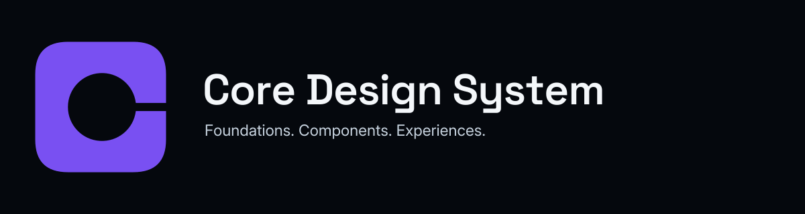

# CDS Brand Guide — Negative Core

**Core Design System**

Creative direction and displayed visual implementation accepted by the Human
Maintainer in conversation on 2026-09-30 ("ok, weiter"). A later corrective pass
removed the organizational endorsement lettering and set the social-preview claim
on one line; the mark is unchanged. Independent review of the corrected kit and
repository integration remain pending. No publication is implied.



## Identity

Core Design System is the project name; CDS is its abbreviation. The primary line
remains **Foundations. Components. Experiences.**

The mark is a solid, softly squared C with a circular negative-space core and a
narrow opening to the right. It combines the initial of Core with a quiet aperture
metaphor. The gap suggests openness and connection. It is not an architecture diagram.

## Design reference

The supplied Blackhole Dynamics Branding Kit v0.2.0 served as a design reference
for dark neutrals, light typography and the Space Grotesk / Inter pairing. CDS
retains an independent violet accent, and no mark, slogan or lettering from that
kit is used. This records design provenance only. The kit establishes no
endorsement, parent-brand, masterbrand or product-family relationship. Such
relationships belong to Brand and Identity (Layer 2) and remain open; any future
endorsement needs its own separately authorized decision.

## Artwork palette

| Colour | Hex | Use within these assets |
| --- | --- | --- |
| Void | `#05080D` | Dark ground; taken from the design reference |
| Signal White | `#F4F7FA` | Main lettering; taken from the design reference |
| Stellar Silver | `#C8D4E0` | Supporting lettering; taken from the design reference |
| CDS artwork violet | `#7950F2` | Independent project mark |

These labels and values document artwork only. They define no Core token, formal
visual-role vocabulary, consumer override or conformance reference.

## Typography

Space Grotesk, weight 600, carries the project name. Inter, weight 400, carries the
claim and the overline. Headings use compact spacing; small text
avoids excessive tracking. The small identifying overline is secondary.

Production SVG lettering is converted to paths using the actual source fonts.
This avoids local-font substitution and external resources. Text meaning remains
in title/description and group labels. Use normal live text for README headings,
copy and navigation; outlined artwork is not a substitute for readable document text.

Source information and font hashes: [Font provenance](FONT_PROVENANCE.md).

## Asset use

[Complete asset table](README.md).

- Use the violet mark on dark or light neutral backgrounds with sufficient contrast.
- Use the light monochrome mark on dark grounds and the dark mark on light grounds.
- Use the horizontal logo where name and claim can both remain readable.
- Use the banner for the repository hero and the 2:1 social preview for link cards.
- Preserve aspect ratio, the circular cutout and the deliberate narrow opening.
- Do not add an orbit, glow, bevel, gradient, shadow or decorative texture.

## Space and scale

The mark's visible body is 384 units wide on a 512-unit transparent canvas. The
64-unit outer margin is part of its intended clear space. Keep adjacent content
outside the full canvas. Around complete lockups, allow at least the height of
the claim lettering as additional external space.

Start with a 32-pixel mark and a logo at least 720 pixels wide. These are practical
review recommendations, not certified minimums. At 16–24 pixels the aperture can
collapse; a dedicated favicon simplification needs its own small-size review.
On narrow screens, prefer a mark plus live-text name over a miniature full lockup.

Banner and social-preview supporting text may become small at mobile sizes.
Repeat the full project name, claim and development status as nearby live text.

## Voice and reusable positioning

**DE:** Core Design System (CDS) entwickelt gemeinsame, geregelte Design-Grundlagen
für konsistente und zugängliche digitale Produkte im Core-Ökosystem. Foundations,
Design Tokens, Komponenten, Patterns und Experiences werden mit nachvollziehbarer
Evidenz und klaren Verantwortlichkeiten aufgebaut.

**EN:** Core Design System (CDS) is developing shared, governed design foundations
for consistent, accessible digital products across the Core ecosystem. Foundations,
design tokens, components, patterns and experiences are developed with traceable
evidence and clear ownership.

Write concretely and distinguish present capabilities from future goals. Keep the
status visible: **Private Development; no public release.** Do not imply system-wide
Candidate or Stable maturity, certification or production readiness.

## Accessibility and embedding

Suggested standalone mark alt text: “Core Design System — Negative Core mark.”
Suggested hero alt text: “Core Design System. Foundations. Components.
Experiences.” Use empty alt text only where an adjacent text equivalent
makes the image decorative. A linked image must have a meaningful accessible name.

Colour is decorative identity, never the sole carrier of status or meaning.
Monochrome versions preserve the same silhouette. Embedded SVG images still need
appropriate HTML alt text; their internal titles do not replace that requirement.
No CDS accessibility evidence admission or conformance claim follows from this kit.

## Sources, exports and revision

The six standalone SVGs are the production artwork sources. Their PNG derivatives
must be regenerated from them, not edited separately. Each SVG has title, description,
role and viewBox, with no remote resources, scripts or embedded raster content.

Raster exports were generated at native size using Sharp 0.35.4 (libvips 8.18.6,
librsvg 2.62.91). To reproduce an export with Sharp available in Node.js:

```js
await sharp(svgPath).png().toFile(pngPath);
```

Changing outlined wording requires re-outlining the same fonts, then visually
checking spacing and all exports. Regenerate the portable kit afterwards (see the
[asset README](README.md)). Keep artwork changes within branding scope.
The superseded, never-integrated Core Grid iteration is retained in the repository
under `branding/archive/core-grid/`; it is not part of the portable kit.

## Authority boundary

Repository identity artwork is non-normative with respect to CDS Core visual token
values. Selection of this creative direction creates no normative Brand Foundation,
Core value, Source Set, Product Profile, work-package authorization, evidence
admission, maturity, release or publication transition. No licensing decision for
CDS is made. Third-party font notices concern their fonts only.

See the Visual Foundation Brand and Product Profile Boundary,
`docs/governance/VISUAL_FOUNDATION_BRAND_AND_PROFILE_BOUNDARY.md` in the CDS
repository.
