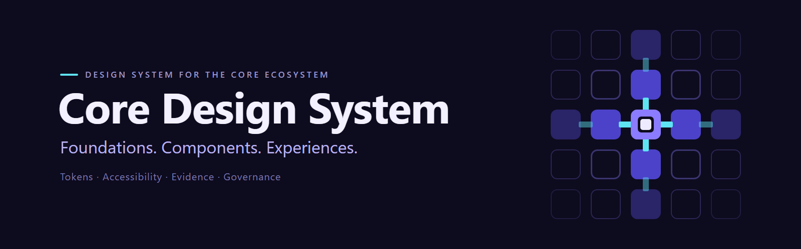
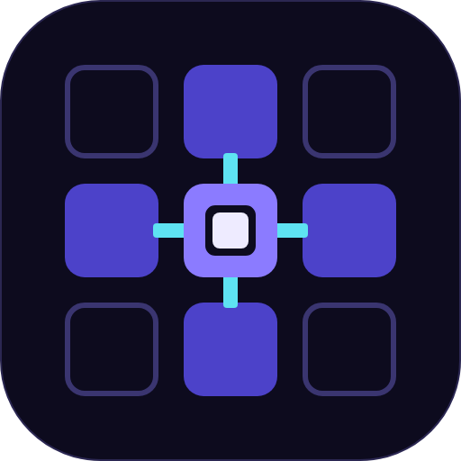
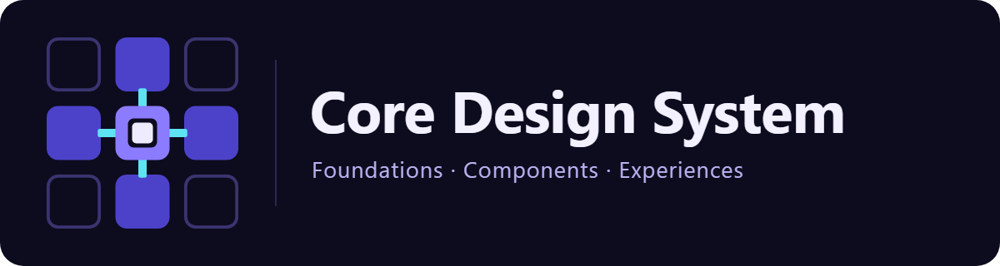
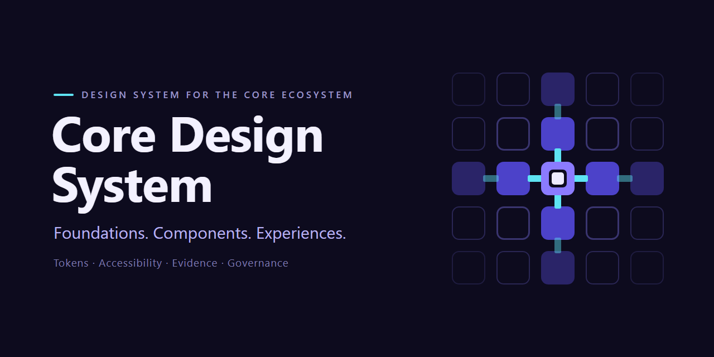

# CDS Brand Guide

Repository identity kit | Draft for design and content review

## Purpose and authority

This kit documents the existing Core Grid artwork for the Core Design System
repository. Its usage recommendations are proposed project-branding guidance.
Human-Maintainer acceptance is pending. It makes no CDS conformance claim.

Repository identity artwork is non-normative with respect to CDS Core visual token
values. Artwork colours and dimensions below are not Core tokens, Source Set
contents or consumer overrides. This kit creates no Brand Foundation, activates no
Product Profile or work package, and changes no evidence, maturity or publication
state. Publication remains Private Development.

Authority boundary: [Visual Foundation Brand and Product Profile Boundary](../../../docs/governance/VISUAL_FOUNDATION_BRAND_AND_PROFILE_BOUNDARY.md).
NDF governs the development process; CDS governs design-system semantics within
its defined scope. This document does not change either authority.

## Identity and positioning

**Name:** Core Design System. **Short name:** CDS.

**Primary line:** Foundations. Components. Experiences.

Use the full name at first contact. Use CDS after introducing the abbreviation.
The English primary line stays consistent in both language contexts.

**DE:** Core Design System (CDS) entwickelt eine gemeinsame, geregelte Grundlage
fuer konsistente und zugaengliche digitale Produkte im Core-Oekosystem.
Foundations, Design Tokens, Komponenten, Patterns und Experiences werden mit
nachvollziehbarer Evidenz und klaren Verantwortlichkeiten aufgebaut.

**EN:** Core Design System (CDS) is developing a shared, governed foundation for
consistent, accessible digital products across the Core ecosystem. Foundations,
design tokens, components, patterns and experiences are developed with traceable
evidence and clear ownership.

These statements describe direction, not production readiness. Pair first-contact
presentation with a visible development-status statement in ordinary text.

## Core Grid

A three-by-three grid centres on a layered core. Four filled modules connect to
that core. Four outlined corners suggest space for further composition. Banner
and social-preview artwork extend this idea into a five-by-five field.

The motif communicates structure, reuse and relationships. It is a visual metaphor,
not a diagram of CDS architecture or a mapping of its eight logical layers.

Keep the character precise, calm and technical. Use flat colour, deliberate space
and a clear text hierarchy. Avoid decorative gradients, AI-star imagery, dense
micro-detail and interface screenshots inside the mark.

## Asset selection

| Asset | Source | Export | Canvas | Use |
| --- | --- | --- | --- | --- |
| Mark | [SVG](assets/svg/cds-mark.svg) | [PNG](assets/png/cds-mark.png) | 512 x 512 | Project avatar or compact identity |
| Logo | [SVG](assets/svg/cds-logo.svg) | [PNG](assets/png/cds-logo.png) | 1200 x 320 | Horizontal project signature |
| Banner | [SVG](assets/svg/cds-banner.svg) | [PNG](assets/png/cds-banner.png) | 1600 x 500 | README hero |
| Social preview | [SVG](assets/svg/cds-social-preview.svg) | [PNG](assets/png/cds-social-preview.png) | 1280 x 640 | Repository link preview |

Use the complete supplied canvas and preserve its aspect ratio. Keep the dark
background; transparent corners do not make these light-background variants.
No approved light or monochrome variant is supplied in this kit.

## Space, scale and placement

The following are starting recommendations for review, not validated minimums:

- Mark: start at 32 x 32 CSS pixels. Review 16-24 pixel applications separately;
  connectors and outlined corners may lose definition. No favicon is supplied.
- Logo: start at 600 CSS pixels wide, where its 27-unit tagline becomes 13.5 pixels.
  At narrower widths prefer the mark with a separate live-text project name.
- Banner: use the available README width. Repeat the project name and positioning
  in live text because its supporting lines become small on narrow screens.
- Social preview: retain the full 2:1 canvas and inspect the actual platform crop.
  Essential identification comes from the large name, not the small supporting line.
- Keep external text or other logos at least one central-module width away from
  the mark. For the logo, start with an external gap of one quarter of its height.
  Preserve the internal margins of banner and social artwork.

Do not stretch, rotate, crop, rearrange or recolour the supplied identity. Do not
add status meanings to individual squares or use the mark as a certification seal.

## Artwork colour inventory

These values are transcribed from the SVG sources. Labels describe their use in
this artwork only; they are not a CDS visual-role vocabulary or token names.

| Artwork use | Hex |
| --- | --- |
| Dark ground | `#0D0B1E` |
| Filled modules | `#4C42C9` |
| Central core | `#8B7BFF` |
| Connections and short accent | `#5EE3F2` |
| Inner square | `#EEEBFF` |
| Project-name text | `#F3F1FF` |
| Tagline | `#B9B2F0` |
| Overline | `#9C96C8` |
| Supporting text | `#7E79AD` |
| Mark border and logo divider | `#2B2752` |
| Inner grid outlines | `#3A3570` |
| Outer grid outlines | `#1F1C40`, `#2A2654` |
| Outer filled modules | `#2A2468` |

Some outer cyan connectors use 45% opacity. These decorative colours are not a
UI palette. Do not infer text, focus, status or accessibility suitability from them.

## Typography

The sources use Segoe UI, Helvetica Neue, Helvetica, Arial, Liberation Sans,
sans-serif, in that order. No font file is bundled. The existing PNG exports were
reported as rendered with Segoe UI; alternative installed fonts may change SVG
text metrics. Inspect each export for overflow and spacing.

| Asset | Project name | Tagline | Additional text |
| --- | --- | --- | --- |
| Logo | 70 units, weight 700 | 27 units, weight 400 | None |
| Banner | 86 units, weight 700 | 34 units, weight 400 | Overline 17/600; support 20/400 |
| Social preview | 88 units, weight 700, two lines | 30 units, weight 400 | Overline 17/600; support 19/400 |

These are source-artwork dimensions, not a product typography scale. Use live text
for documentation paragraphs, navigation and current status.

## Voice and reusable copy

Write directly and concretely. Explain what exists today before describing future
capabilities. Keep German and English statements equivalent in meaning.

**Short DE description:** Gemeinsame Design-Grundlagen fuer das Core-Oekosystem.

**Short EN description:** Shared design foundations for the Core ecosystem.

**DE status:** In strukturierter Entwicklung. Kein oeffentliches Release; die
Projektidentitaet trifft keine Aussage ueber Reifegrad oder CDS-Konformitaet.

**EN status:** Under structured development. No public release; the project
identity makes no maturity or CDS conformance claim.

Avoid unsupported language such as production-ready, certified, fully accessible,
or system-wide Stable/Candidate. Do not add a licensing claim.

## Accessible use

Provide a nearby live-text project name and introduction. The grid carries no
information that must be inferred from colour alone. Faint outer lines are
ornamental and must never be the only carrier of information.

Suggested alt text for a standalone mark: "Core Design System: Core Grid mark."
For a banner used as the only identity heading: "Core Design System. Foundations.
Components. Experiences." If equivalent adjacent text already conveys everything,
a decorative empty alt attribute can avoid repetition. A linked image needs an
accessible link name identifying its destination.

The SVG title and description help when the SVG is viewed directly; when embedded
through an HTML image element, supply appropriate alt text there as well.

No accessibility conformance or small-size validation is awarded by this guide.

## Source and export workflow

1. Edit the standalone SVG source when an artwork revision is authorized.
2. Preserve title, description, intrinsic dimensions and viewBox. Keep scripts,
   remote resources, embedded fonts and raster content out of the source.
3. Render the PNG directly from that SVG at the dimensions listed above.
4. Inspect full-size and intended display-size output for crop, spacing and text.
5. Review the source and derivative together. Never retouch the PNG independently.

The supplied SVGs and PNGs are the asset set for this draft. A repository-settings
upload, publication, integration or acceptance is a separate action.

## Review checklist

- Core Grid and project name remain recognisable at the intended display size.
- Tagline and supporting text are readable where they are needed.
- Full canvas, spacing and aspect ratio are preserved.
- Alt text and live-text introduction fit the actual embedding context.
- SVG and PNG remain visually aligned.
- Project status is truthful; artwork is not described as normative CDS values.
- Human-Maintainer design/content acceptance is recorded through the existing process.
